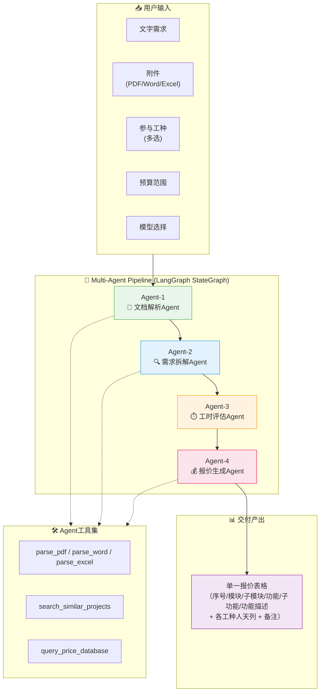
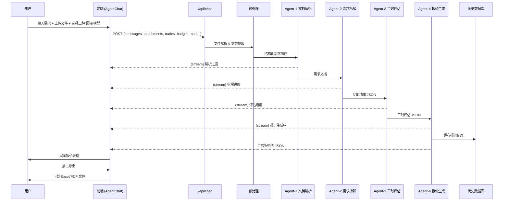

# 方案设计与报价Agent — 系统设计文档

## 1. 系统概述

### 1.1 目标

用户通过 Agent 对话框提交产品需求（文字描述 + PDF/Word/Excel 附件），系统自动交付：
- 产品功能需求拆解清单
- 对应工时报价表

交付形式为结构化表格，支持前端展示与导出（Excel/PDF）。

### 1.2 技术栈

| 层级 | 技术 | 说明 |
|------|------|------|
| 前端框架 | Next.js 16 (App Router) + React 19 | 全栈框架，支持 SSR + API Route |
| UI 组件库 | shadcn/ui + Agent Elements | shadcn 提供基础 UI 原语，Agent Elements 提供 Agent 对话专用组件 |
| 样式系统 | Tailwind CSS v4 | 原子化 CSS |
| AI 编排 | LangChain / LangGraph | 多 Agent 管道编排与 LLM 调用管理 |
| 流式通信 | Vercel AI SDK (`useChat`) | 前端流式消费 Agent 输出 |
| 文件解析 | pdf-parse, mammoth (Word), xlsx (Excel) | 服务端解析上传文件 |
| 表格导出 | exceljs (Excel), jspdf (PDF) | 前端表格导出 |

### 1.3 参与工种

用户可在 Config Bar 中选择项目所需的参与工种。报价将按所选工种分别计算工时与费用。

| 工种 | 说明 | 人天单价 |
|------|------|---------|
| 前端开发 | Web/H5/小程序前端 | ¥2,000/人天 |
| 后端开发 | API/微服务/数据库 | ¥2,500/人天 |
| UI 设计 | 界面设计/交互原型 | ¥2,000/人天 |
| 测试 | 功能测试/自动化测试 | ¥1,800/人天 |
| 项目管理 | 需求管理/进度跟踪 | ¥3,000/人天 |
| DevOps | CI/CD/部署运维 | ¥2,800/人天 |
| 数据分析 | BI/数据仓库/ETL | ¥3,000/人天 |
| AI/算法 | 模型训练/调优/部署 | ¥4,000/人天 |

选中的工种将出现在工时报价表中作为列维度。

---

## 2. 系统架构

### 2.1 整体架构图

```
┌─────────────────────────────────────────────────────────────┐
│                      用户浏览器 (Frontend)                    │
│  ┌───────────────────────────────────────────────────────┐  │
│  │                 AgentChat (Agent Elements)              │  │
│  │  ┌─────────────────────────────────────────────────┐  │  │
│  │  │               MessageList                        │  │  │
│  │  │  • User messages (文本 + 附件预览)                │  │  │
│  │  │  • Agent thinking cards (ThinkingTool)           │  │  │
│  │  │  • Pipeline progress (PlanTool)                   │  │  │
│  │  │  • Final table result (Custom Tool Card)          │  │  │
│  │  └─────────────────────────────────────────────────┘  │  │
│  │  ┌─────────────────────────────────────────────────┐  │  │
│  │  │               InputBar                            │  │  │
│  │  │  ┌────────┐ ┌──────────┐ ┌──────────┐ ┌───────┐ │  │  │
│  │  │  │文件上传│ │参与工种  │ │预算范围  │ │模型   │ │  │  │
│  │  │  │pdf/word│ │前端/后端 │ │¥1-50万  │ │GPT-4o │ │  │  │
│  │  │  │/excel  │ │/UI/测试…│ │ 滑块    │ │DeepS  │ │  │  │
│  │  │  └────────┘ └──────────┘ └──────────┘ └───────┘ │  │  │
│  │  │  [──────────────────────────────────────────────]│  │  │
│  │  │                                            [▶]  │  │  │
│  │  └─────────────────────────────────────────────────┘  │  │
│  └───────────────────────────────────────────────────────┘  │
└───────────────────────┬─────────────────────────────────────┘
                        │ SSE Stream (Vercel AI SDK)
                        ▼
┌─────────────────────────────────────────────────────────────┐
│                   Next.js API Route (/api/chat)              │
│  ┌───────────────────────────────────────────────────────┐  │
│  │              Request Preprocessing                     │  │
│  │  1. Extract text from attachments (pdf/word/excel)    │  │
│  │  2. Parse trades, budget_range & model from metadata  │  │
│  │  3. Merge into unified input context                  │  │
│  └───────────────────────┬───────────────────────────────┘  │
│                          ▼                                   │
│  ┌───────────────────────────────────────────────────────┐  │
│  │          Multi-Agent Pipeline (LangGraph)              │  │
│  │                                                        │  │
│  │  Agent-1 ──► Agent-2 ──► Agent-3 ──► Agent-4 ──►     │  │
│  │  (文档解析)  (需求拆解)  (工时评估)  (报价生成)       │  │
│  │                                                        │  │
│  │  State: { raw_input → parsed_doc → requirements[]     │  │
│  │           → estimates[] → quotation_table }            │  │
│  └───────────────────────────────────────────────────────┘  │
└─────────────────────────────────────────────────────────────┘
```

### 2.2 Multi-Agent Pipeline 串行架构



### 2.3 各 Agent 职责详述

#### Agent-1: 文档解析Agent (Document Parser)

```
Input:  Raw text + uploaded files (PDF/Word/Excel)
Output: 结构化的产品需求描述文档

职责:
1. 调用文件解析工具提取附件内容
2. 将碎片化信息整合为统一的需求描述
3. 识别关键信息：产品类型、目标用户、核心功能、技术约束
4. 输出 Markdown 格式的结构化需求文档

工具:
- parse_pdf: 提取 PDF 文本/图片
- parse_word: 提取 Word 文档内容
- parse_excel: 提取 Excel 表格数据（可能是功能清单初稿）
```

#### Agent-2: 需求拆解Agent (Requirement Decomposer)

```
Input:  结构化需求描述文档
Output: 功能拆解清单 (平铺表格 JSON Array)

职责:
1. 将产品需求拆解为五级层次结构：模块 → 子模块 → 功能 → 子功能
2. 每个叶子节点逐行列出，父级通过合并行体现层级关系
3. 为每一行编写简洁的功能描述
4. 区分"设计类"（系统设计/数据建模）与"业务功能类"
5. 参考行业标准功能拆解模式

输出格式 (平铺行，与最终报价单结构对齐):
[
  {
    "seq": 1,
    "module": "系统设计",
    "sub_module": "前后端基础系统框架设计",
    "function": "框架建设",
    "sub_function": "框架建设",
    "description": "前后端基础技术栈选型架构搭建",
    "category": "design"         // "design"=设计类, "feature"=业务功能类
  },
  {
    "seq": 2,
    "module": "系统设计",
    "sub_module": "数据设计",
    "function": "数据建模",
    "sub_function": "数据建模",
    "description": "数据建模",
    "category": "design"
  },
  {
    "seq": 3,
    "module": "可视化大屏",
    "sub_module": "一级页面：新兴市场运营看板",
    "function": "总营收",
    "sub_function": "新兴市场运营营收总额",
    "description": "统计截至最新的所有分公司的当年总营收...",
    "category": "feature"
  },
  ...
]
```

#### Agent-3: 工时评估Agent (Effort Estimator)

```
Input:  功能拆解清单 + 参与工种列表
Output: 每行功能点的工种工时评估（填入对应工种列）

职责:
1. 根据每行功能点的描述评估各工种所需人天
2. 仅评估用户所选工种的工时（列动态生成，如仅选前后端则只输出后端、前端列）
3. 系统设计类（category=design）单独按工种评估
4. 考虑技术栈复杂度、第三方集成等因素
5. 评估基准: 简单展示 0.5人天 / 含图表页面 1-2人天 / 复杂交互 2-3人天

输出格式 (在原清单基础上追加工种列):
[
  {
    "seq": 1,
    "module": "系统设计",
    ...,
    "trades": {
      "backend": 3,    // 仅当该工种被选中时存在
      "frontend": 0,   // "-" 表示不适用，用 0 或 null
      "testing": 0
    }
  },
  {
    "seq": 3,
    "module": "可视化大屏",
    ...,
    "trades": {
      "backend": 0.5,
      "frontend": 0.5,
      "testing": 3
    }
  },
  ...
]
```

#### Agent-4: 报价生成Agent (Quotation Generator)

```
Input:  带工种工时的功能清单 + 预算范围
Output: 最终报价单 Excel (.xlsx)，单一表格

职责:
1. 将功能清单 + 各工种工时整合为一张平铺报价表
2. 同级单元格合并（模块/子模块/功能/子功能列按层级合并）
3. 生成表头信息区：客户名称、项目名称、报价单位、报价时间
4. 若预算紧张，生成"减配方案"建议在前端展示
5. 输出标准 .xlsx 文件供前端展示和下载

输出 Excel 结构 (单 Sheet):
┌──────┬──────────┬────────────┬──────────┬──────────┬──────────────┬──────┬──────┬──────┬──────┐
│ 序号 │ 模块     │ 子模块     │ 功能     │ 子功能   │ 功能描述     │ 后端 │ 前端 │ 测试 │ 备注 │
├──────┼──────────┼────────────┼──────────┼──────────┼──────────────┼──────┼──────┼──────┼──────┤
│  1   │ 系统设计 │ 前后端基础 │ 框架建设 │ 框架建设 │ 前后端基础.. │ 3    │ -    │ -    │ -    │
├──────┤          │ 系统框架   ├──────────┼──────────┼──────────────┼──────┼──────┼──────┼──────┤
│  2   │          │ 设计       │ 数据建模 │ 数据建模 │ 数据建模     │ 2    │ -    │ -    │ -    │
├──────┼──────────┼────────────┼──────────┼──────────┼──────────────┼──────┼──────┼──────┼──────┤
│  3   │ 可视化   │ 一级页面： │ 总营收   │ 新兴市场 │ 统计截至最.. │ 0.5  │ 0.5  │ 3    │ 概述  │
│      │ 大屏     │ 新兴市场   │          │ 营收总额 │              │      │      │      │      │
├──────┤          │ 运营看板   ├──────────┼──────────┼──────────────┼──────┼──────┼──────┼──────┤
│  4   │          │            │ 分公司   │ 各个分公 │ 统计截至最.. │ -    │ 0.5  │ -    │ -    │
│      │          │            │ 营收     │ 司营收..  │              │      │      │      │      │
├──────┼──────────┼────────────┼──────────┼──────────┼──────────────┼──────┼──────┼──────┼──────┤
│ ...  │ ...      │ ...        │ ...      │ ...      │ ...          │ ...  │ ...  │ ...  │ ...  │
└──────┴──────────┴────────────┴──────────┴──────────┴──────────────┴──────┴──────┴──────┴──────┘

注意事项:
- 工种列根据用户选择动态生成（如选择3个工种则输出3列）
- 不适用的工种填 "-"
- 模块/子模块/功能/子功能同级值合并单元格
- 表头区域显示客户名称、项目名称、报价单位、报价时间
- 支持前端渲染为 shadcn Table 展示，同时提供 .xlsx 原始文件下载
```

表格固定列 + 动态列规则：

| 列 | 固定/动态 | 说明 |
|----|----------|------|
| 序号 | 固定 | 自增编号 |
| 模块 | 固定 | 一级分类 |
| 子模块 | 固定 | 二级分类 |
| 功能 | 固定 | 三级分类 |
| 子功能 | 固定 | 四级分类 |
| 功能描述 | 固定 | 详细说明 |
| (工种列...) | **动态** | 根据用户所选工种生成，每工种一列，列名为工种名 |
| 备注 | 固定 | 补充说明 |

### 2.4 LangGraph State 定义

```typescript
// lib/agent/state.ts
type TradeRole = "frontend" | "backend" | "design" | "testing" | "pm" | "devops" | "data" | "ai";

interface QuotationRow {
  seq: number;
  module: string;
  sub_module: string;
  function_name: string;      // "功能" 列
  sub_function: string;        // "子功能" 列
  description: string;         // "功能描述" 列
  trades: Record<TradeRole, number | null>;  // 各工种人天，null="不适用"
  remark: string;              // "备注" 列
}

interface PipelineState {
  // 输入层
  rawText: string;
  attachments: Array<{
    name: string;
    type: "pdf" | "word" | "excel";
    content: string;
  }>;
  selectedTrades: TradeRole[];     // 用户选择的参与工种
  budgetRange: [number, number];
  modelProvider: string;

  // 表头信息
  customerName: string;            // 客户名称（从需求中提取或默认）
  projectName: string;             // 项目名称

  // Agent-1 产出
  structuredBrief: string;         // Markdown 需求文档

  // Agent-2 产出
  rows: QuotationRow[];            // 功能拆解清单（平铺行）

  // Agent-3 产出 (在原 rows 基础上填入 trades 人天)
  // rows[].trades 被填充

  // Agent-4 产出 (最终)
  quotationFile: Buffer;           // .xlsx 文件内容

  // 控制层
  currentAgent: string;
  error: string | null;
}
```

---

## 3. 前端设计

### 3.1 页面布局

```
┌─────────────────────────────────────────────────────────┐
│  Header: 方案设计与报价Agent                              │
├─────────────────────────────────────────────────────────┤
│                                                         │
│  ┌───────────────────────┐ ┌─────────────────────────┐  │
│  │                       │ │                         │  │
│  │    Agent 对话框       │ │    报价结果面板          │  │
│  │    (AgentChat)        │ │    (ResultPanel)         │  │
│  │                       │ │                         │  │
│  │  • 对话消息           │ │  • 表头信息（客户/项目）     │  │
│  │  • Thinking cards     │ │  • 单一报价表格             │  │
│  │  • Progress 步骤      │ │  • 下载 .xlsx               │  │
│  │                       │ │                         │  │
│  │                       │ │                         │  │
│  ├───────────────────────┤ │                         │  │
│  │    InputBar            │ │                         │  │
│  │  ┌────┐┌────┐┌────┐┌──┐│ │                         │  │
│  │  │ 📎 ││ 🔧 ││ 💰 ││🤖││ │                         │  │
│  │  └────┘└────┘└────┘└──┘│ │                         │  │
│  └───────────────────────┘ └─────────────────────────┘  │
│                                                         │
└─────────────────────────────────────────────────────────┘
```

左右双栏布局：左侧为 Agent 对话框（60%），右侧为报价结果面板（40%）。

### 3.2 InputBar Config Bar 设计

Config Bar 位于输入框下方，使用 Agent Elements 的 `InputBar` 组件的 `leftActions` / `rightActions` 插槽实现。

```
┌──────────────────────────────────────────────────────────┐
│  [📝 请输入您的产品需求...                           ]  │
├──────────────────────────────────────────────────────────┤
│  ┌────────────┐ ┌──────────────┐ ┌─────────────┐        │
│  │📎 上传文件 │ │🔧 参与工种  │ │💰 预算范围  │        │
│  │ PDF/Word/  │ │ 前端 后端…  │ │ 5万 - 30万  │        │
│  │ Excel      │ │              │ │ ──●──────   │        │
│  └────────────┘ └──────────────┘ └─────────────┘        │
│                                          ┌──────────┐   │
│                                          │🤖 GPT-4o▾│   │
│                                          └──────────┘   │
│                                          ┌────────┐     │
│                                          │  发送 ▶ │     │
│                                          └────────┘     │
└──────────────────────────────────────────────────────────┘
```

#### 3.2.1 文件上传菜单按钮

使用 shadcn `DropdownMenu` + Agent Elements `AttachmentButton`：

| 菜单项 | 接受格式 | 大小限制 |
|--------|---------|---------|
| PDF 文档 | `.pdf` | 10 MB |
| Word 文档 | `.docx`, `.doc` | 10 MB |
| Excel 表格 | `.xlsx`, `.xls` | 10 MB |

上传后显示文件缩略卡片（复用 `FileAttachment` 组件），支持移除。

#### 3.2.2 参与工种选择器 (TradeSelector)

使用 shadcn `Popover` 组件实现，弹窗分为两个区域：顶部横向行业 Tab 栏，下方工种多选列表。

**交互逻辑：**
1. 点击按钮弹出 Popover
2. 顶部为行业 Tab，横向滚动排列（如：电商、金融、医疗、教育、政务、IoT、SaaS、其他）
3. 切换行业 Tab，下方工种列表随之更新（不同行业默认推荐工种不同）
4. 工种以 Checkbox 列表展示，支持多选
5. 至少选择一个工种，按钮上显示已选工种数量（如"🔧 参与工种 (3)"）

```
┌──────────────────────────────────────────┐
│  行业: [电商] [金融] [医疗] [教育] [政务]│ ← 横向 Tab 栏
│         [IoT] [SaaS] [其他]              │
├──────────────────────────────────────────┤
│  ☑ 前端开发     ¥2,000/人天             │
│  ☑ 后端开发     ¥2,500/人天             │
│  ☑ UI 设计      ¥2,000/人天             │
│  ☐ 测试         ¥1,800/人天             │
│  ☐ 项目管理     ¥3,000/人天             │
│  ☐ DevOps       ¥2,800/人天             │
│  ☐ 数据分析     ¥3,000/人天             │
│  ☐ AI/算法      ¥4,000/人天             │
├──────────────────────────────────────────┤
│  [重置]                        [确定(3)] │
└──────────────────────────────────────────┘
```

**行业默认推荐工种：**

| 行业 | 默认选中工种 |
|------|------------|
| 电商 | 前端开发、后端开发、UI 设计、测试 |
| 金融 | 后端开发、前端开发、测试、DevOps |
| 医疗 | 后端开发、前端开发、测试、数据分析 |
| 教育 | 前端开发、后端开发、UI 设计 |
| 政务 | 后端开发、前端开发、项目管理、测试 |
| IoT | 后端开发、前端开发、DevOps、AI/算法 |
| SaaS | 前端开发、后端开发、UI 设计、测试、DevOps |
| 其他 | 前端开发、后端开发（用户自行调整） |

**组件结构：**

```typescript
// components/presales/trade-selector.tsx

const INDUSTRIES = [
  "电商", "金融", "医疗", "教育", "政务",
  "IoT", "SaaS", "其他",
] as const;

const TRADES: TradeOption[] = [
  { id: "frontend", label: "前端开发",   dailyRate: 2000, icon: Monitor },
  { id: "backend",  label: "后端开发",   dailyRate: 2500, icon: Server },
  { id: "design",   label: "UI 设计",    dailyRate: 2000, icon: Palette },
  { id: "testing",  label: "测试",       dailyRate: 1800, icon: Bug },
  { id: "pm",       label: "项目管理",   dailyRate: 3000, icon: Users },
  { id: "devops",   label: "DevOps",     dailyRate: 2800, icon: Cloud },
  { id: "data",     label: "数据分析",   dailyRate: 3000, icon: BarChart3 },
  { id: "ai",       label: "AI/算法",    dailyRate: 4000, icon: Cpu },
];

const INDUSTRY_DEFAULTS: Record<string, string[]> = {
  "电商": ["frontend", "backend", "design", "testing"],
  // ... 其余行业
};
```

#### 3.2.3 预算范围控件

使用 shadcn `Slider`（双滑块，范围选择器）：

```typescript
const BUDGET_PRESETS = [
  { label: "5万以下", range: [0, 50000] },
  { label: "5-15万",  range: [50000, 150000] },
  { label: "15-30万", range: [150000, 300000] },
  { label: "30-50万", range: [300000, 500000] },
  { label: "50万以上", range: [500000, 2000000] },
];
```

双滑块支持自由拖动选择精确预算范围。选中的范围在标签中实时显示。

#### 3.2.4 模型选择器 (ModelPicker)

使用 Agent Elements 内置的 `ModelPicker` 组件，放置于 `rightActions` 区域，位于发送按钮左侧。

```typescript
const AVAILABLE_MODELS = [
  { id: "deepseek-v3",  name: "DeepSeek",    version: "V3" },
  { id: "gpt-4o",       name: "GPT-4o",      version: "latest" },
  { id: "claude-4",     name: "Claude",      version: "4" },
  { id: "qwen-max",     name: "Qwen",        version: "Max" },
  { id: "glm-4-plus",   name: "GLM",         version: "4 Plus" },
];
```

```tsx
<ModelPicker
  models={AVAILABLE_MODELS}
  defaultValue="deepseek-v3"
  onValueChange={(modelId) => setModelProvider(modelId)}
/>
```

默认选中 DeepSeek V3。不同模型在管道各阶段可统一使用，也可按 Agent 节点差异化配置（v2 扩展）。

#### 3.2.5 发送按钮

Agent Elements `SendButton`，发送时将文本内容 + 附件 + 配置项（工种、预算、模型）一并提交。

### 3.3 结果展示面板 (ResultPanel)

右侧面板展示 Agent-4 生成的单一报价表格，渲染为 shadcn `Table`，并提供 `.xlsx` 原始文件下载。

#### 3.3.1 表头信息区

表格上方展示项目基本信息：

```
┌──────────────────────────────────────────────────────────┐
│  客户名称：重庆天玑晟智物联科技有限公司                     │
│  项目名称：新兴市场项目功能清单（1期）                      │
│  报价时间：2025-10-27                                     │
│  报价单位：重庆酷小贝软件开发有限公司                       │
├──────────────────────────────────────────────────────────┤
│  [📥 下载报价单 (.xlsx)]    参与工种：后端 | 前端 | 测试   │
└──────────────────────────────────────────────────────────┘
```

#### 3.3.2 报价表格

使用 shadcn `Table` 组件渲染 Agent-4 输出的平铺报价数据。表格列分为**固定列**和**动态工种列**。

**固定列：**

| 列名 | 说明 | 特性 |
|------|------|------|
| 序号 | 自增编号 | 列宽 60px |
| 模块 | 一级分类 | 同级值合并单元格 (rowSpan) |
| 子模块 | 二级分类 | 同级值合并 |
| 功能 | 三级分类 | 同级值合并 |
| 子功能 | 四级分类 | 同级值合并 |
| 功能描述 | 详细说明 | 列宽 300px，支持 tooltip 展开 |
| 备注 | 补充信息 | 列宽 200px |

**动态工种列：** 根据用户所选工种逐一生成列，列名为工种名，单元格值为人天数。

**示例（工种选择：后端 + 前端 + 测试）：**

```
┌────┬────────┬──────────┬────────┬──────────┬────────────────┬──────┬──────┬──────┬──────┐
│序号│ 模块   │ 子模块   │ 功能   │ 子功能   │ 功能描述       │ 后端 │ 前端 │ 测试 │ 备注 │
├────┼────────┼──────────┼────────┼──────────┼────────────────┼──────┼──────┼──────┼──────┤
│ 1  │系统设计│前后端基础│框架建设│框架建设  │前后端基础技术栈│  3   │  -   │  -   │  -   │
│    │        │系统框架  │        │          │选型架构搭建    │      │      │      │      │
├────┤        │设计      ├────────┼──────────┼────────────────┼──────┼──────┼──────┼──────┤
│ 2  │        │          │数据建模│数据建模  │数据建模        │  2   │  -   │  -   │  -   │
├────┼────────┼──────────┼────────┼──────────┼────────────────┼──────┼──────┼──────┼──────┤
│ 3  │可视化  │一级页面：│总营收  │新兴市场  │统计截至最新的所│ 0.5  │ 0.5  │  3   │详见原│
│    │大屏    │运营看板  │        │营收总额  │有分公司当年总..│      │      │      │型    │
├────┤        │          ├────────┼──────────┼────────────────┼──────┼──────┼──────┼──────┤
│ 4  │        │          │分公司  │各个分公司│统计截至最新的每│  -   │ 0.5  │  -   │  -   │
│    │        │          │营收    │营收总额  │个分公司当年总..│      │      │      │      │
├────┼────────┼──────────┼────────┼──────────┼────────────────┼──────┼──────┼──────┼──────┤
│ …  │ …      │ …        │ …      │ …        │ …              │ …    │ …    │ …    │ …    │
└────┴────────┴──────────┴────────┴──────────┴────────────────┴──────┴──────┴──────┴──────┘
```

**表格交互特性：**
- **合并单元格**: 模块/子模块/功能/子功能列同级值自动合并 (`rowSpan`)
- **列宽可调**: 用户可拖动列边界调整宽度
- **固定表头**: 表头在滚动时固定可见
- **不适用标识**: 某工种不参与的功能点显示 "-"
- **下载按钮**: 表格上方提供 .xlsx 文件下载，包含完整合并单元格和格式

#### 3.3.3 导出

后端 Agent-4 直接生成 `.xlsx` 文件，前端同时支持：
- **直接下载**: 下载服务端生成的原始 .xlsx（含合并单元格、格式化）
- **前端渲染**: 将 JSON 数据渲染为 shadcn Table，供在线预览

---

## 4. 数据流



### 4.1 流式输出策略

使用 Vercel AI SDK 的 `streamText` 能力，在 LangGraph pipeline 的每个节点完成后向前端发送增量更新：

```typescript
// API Route 伪代码
const pipeline = createPipeline();

for await (const event of pipeline.stream(input)) {
  switch (event.type) {
    case "agent_start":
      writer.write(createToolCallPart("plan", { step: event.agent }));
      break;
    case "agent_progress":
      writer.write(createToolCallPart("thinking", { content: event.message }));
      break;
    case "agent_complete":
      writer.write(createToolResultPart(event.output));
      break;
    case "pipeline_complete":
      writer.write(createAssistantMessage(event.quotation));
      break;
  }
}
```

前端通过 `toolRenderers` 自定义渲染每种事件类型的 UI 卡片。

---

## 5. 目录结构

```
presales/
├── app/
│   ├── api/
│   │   └── chat/
│   │       └── route.ts            # API Route: 对话入口
│   ├── layout.tsx
│   ├── page.tsx                    # 主页面
│   └── globals.css
├── components/
│   ├── agent-elements/             # Agent Elements 组件 (shadcn registry)
│   ├── ui/                         # shadcn 基础 UI 组件
│   ├── presales/
│   │   ├── agent-chat-panel.tsx    # 左侧 Agent 对话框面板
│   │   ├── config-bar.tsx          # Config Bar (文件上传/工种/预算/模型)
│   │   ├── file-upload-menu.tsx    # 文件上传下拉菜单
│   │   ├── trade-selector.tsx      # 参与工种选择器 (行业Tab + 多选)
│   │   ├── budget-slider.tsx       # 预算范围双滑块
│   │   ├── model-picker.tsx        # 模型选择器 (封装Agent Elements ModelPicker)
│   │   ├── result-panel.tsx        # 右侧报价结果面板 (表格渲染)
│   │   ├── quotation-table.tsx     # 报价表格 (固定列 + 动态工种列)
│   │   ├── quotation-header.tsx    # 表头信息区 (客户/项目/时间)
│   │   └── export-buttons.tsx      # 下载按钮组 (.xlsx)
│   └── ...
├── lib/
│   ├── agent/
│   │   ├── pipeline.ts             # LangGraph pipeline 定义
│   │   ├── state.ts                # Pipeline state 类型
│   │   ├── nodes/
│   │   │   ├── parser.ts           # Agent-1: 文档解析
│   │   │   ├── decomposer.ts       # Agent-2: 需求拆解
│   │   │   ├── estimator.ts        # Agent-3: 工时评估
│   │   │   └── quoter.ts           # Agent-4: 报价生成
│   │   ├── tools/
│   │   │   ├── file-parser.ts      # 文件解析工具集
│   │   │   ├── xlsx-generator.ts   # .xlsx 生成工具 (openpyxl/csv)
│   │   │   └── template.ts         # 输出模板
│   │   └── prompts/
│   │       ├── parser.md           # Agent-1 系统提示
│   │       ├── decomposer.md       # Agent-2 系统提示
│   │       ├── estimator.md        # Agent-3 系统提示
│   │       └── quoter.md           # Agent-4 系统提示
│   ├── utils.ts
│   └── constants.ts                # 工种列表、行业默认配置、人天单价常量
├── docs/
│   └── design.md                   # 本文档
└── ...
```

---

## 6. 关键技术决策

### 6.1 为什么选择串行 Pipeline？

| 对比维度 | 串行 Pipeline ✅ | 并行 Agent 协作 |
|---------|-----------------|----------------|
| 输出确定性 | 高 — 每阶段有明确的前置依赖 | 低 — 并发合并需额外协调逻辑 |
| 调试可观测性 | 高 — 每阶段可独立检查 | 低 — 竞态条件不易重现 |
| 用户等待体验 | 可接受 — 流式展示每阶段进度 | 理论更快但不可控 |
| 上下文一致性 | 强 — 前一阶段产出精确传入后续 | 弱 — 需共享状态同步 |

**决策**: 当前场景中需求拆解依赖文档解析、报价依赖工时评估，天然串行依赖。选择串行 Pipeline 确保准确性。

### 6.2 为什么使用 LangGraph 而非自定义编排？

- **状态管理**: LangGraph 内置 `StateGraph`，支持类型化状态在节点间流转
- **流式支持**: 原生支持 `stream()` 方法，逐节点 yield 事件
- **错误恢复**: 内置 `Checkpointer` 支持状态持久化与重试
- **生态兼容**: 与 LangChain tools、prompts 无缝集成
- **可扩展性**: 未来可从串行扩展为条件分支（如不同文件类型走不同解析节点）

### 6.3 报价精度策略

| 层级 | 策略 | 说明 |
|------|------|------|
| L1: LLM 评估 | 大模型根据功能描述估算工时 | 适合模糊需求，准确度 ~70% |
| L2: 历史匹配 | 向量检索相似历史项目 | 提高同类项目准确度 |
| L3: 工种校准 | 根据用户所选工种动态生成报价维度，未选工种不参与计算 | 确保报价相关性 |
| L4: 人工审核 | 最终报价标注"AI生成，仅供参考" | 风险免责 |

---

## 7. 后续扩展方向 (Out of scope for v1)

- [ ] 历史报价数据积累 → 构建向量检索库提升精度
- [ ] 人天单价动态调整（根据市场行情、技术稀缺度）
- [ ] 多轮对话澄清模糊需求（Agent 主动提问）
- [ ] 报价对比模式（2-3 个方案供用户选择）
- [ ] 技术方案推荐（基于需求自动推荐技术栈）
- [ ] 团队匹配（根据工时推荐所需人员配置）
- [ ] 报价审批工作流（内部审核后发送给客户）
