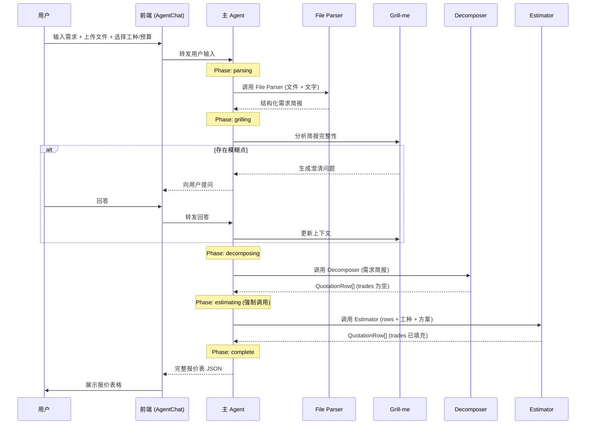
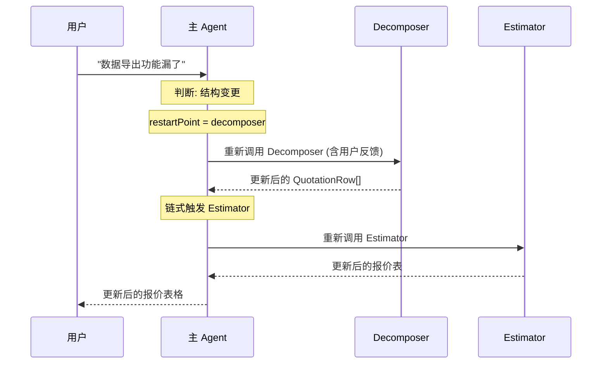

# 方案设计与报价Agent — 系统设计文档

## 1. 系统概述

### 1.1 目标

用户通过 Agent 对话框提交产品需求（文字描述 + 图片/PDF/Word/Excel 附件），系统自动交付：
- 产品功能需求拆解清单
- 对应工时报价表

交付形式为结构化表格，支持前端展示与导出（Excel/PDF）。

### 1.2 技术栈

| 层级 | 技术 | 说明 |
|------|------|------|
| 前端框架 | Next.js 16 (App Router) + React 19 | 全栈框架，支持 SSR + API Route |
| UI 组件库 | shadcn/ui + Agent Elements | shadcn 提供基础 UI 原语，Agent Elements 提供 Agent 对话专用组件 |
| 样式系统 | Tailwind CSS v4 | 原子化 CSS |
| AI 编排 | LangChain / LangGraph | 多 Agent 管道编排与 LLM 调用管理 |
| 流式通信 | Vercel AI SDK (`useChat`) | 前端流式消费 Agent 输出 |
| 文件解析 | pdf-parse, mammoth (Word), xlsx (Excel), sharp (Image) | 服务端解析上传文件 |
| 表格导出 | exceljs (Excel), jspdf (PDF) | 前端表格导出 |

### 1.3 参与工种

用户可在 Config Bar 中选择项目所需的参与工种。报价将按所选工种分别计算工时与费用。

| 工种 | 说明 | 人天单价 |
|------|------|---------|
| 前端开发 | Web/H5/小程序前端 | ¥2,000/人天 |
| 后端开发 | API/微服务/数据库 | ¥2,500/人天 |
| UI 设计 | 界面设计/交互原型 | ¥2,000/人天 |
| 测试 | 功能测试/自动化测试 | ¥1,800/人天 |
| 项目管理 | 需求管理/进度跟踪 | ¥3,000/人天 |
| DevOps | CI/CD/部署运维 | ¥2,800/人天 |
| 数据分析 | BI/数据仓库/ETL | ¥3,000/人天 |
| AI/算法 | 模型训练/调优/部署 | ¥4,000/人天 |

选中的工种将出现在工时报价表中作为列维度。

---

## 2. 系统架构 — 主从架构 (Master-Slave)

### 2.1 架构概览

系统采用 **主从架构**：一个直接与用户对话的 **主 Agent (Master Agent)** 负责交互调度，三个 **子 Agent (Sub-Agent)** 各司其职。主 Agent 维护一份统一的 **报价表**（共享状态），子 Agent 在调度链中按序写入。

```
┌──────────────────────────────────────────────────────────────────┐
│                        用户浏览器 (Frontend)                       │
│  ┌────────────────────────────────────────────────────────────┐  │
│  │                  AgentChat (Agent Elements)                 │  │
│  │  ┌──────────────────────────────────────────────────────┐  │  │
│  │  │  对话消息（文本 + 附件预览 + 进度卡片 + 报价表格）    │  │  │
│  │  └──────────────────────────────────────────────────────┘  │  │
│  │  ┌──────────────────────────────────────────────────────┐  │  │
│  │  │  InputBar + Config Bar（文件/工种/预算/模型）          │  │  │
│  │  └──────────────────────────────────────────────────────┘  │  │
│  └────────────────────────────────────────────────────────────┘  │
└────────────────────────────────┬─────────────────────────────────┘
                                 │ SSE Stream (Vercel AI SDK)
                                 ▼
┌──────────────────────────────────────────────────────────────────┐
│                    主 Agent (Master Agent)                        │
│                                                                  │
│  • 与用户直接对话，接收所有输入                                      │
│  • 调度子 Agent（固定顺序，保证报价表一致性）                          │
│  • 维护报价表共享状态                                              │
│  • 内置 Grill-me Skill，在解析文件后可向用户提问澄清模糊需求           │
│              │                                                   │
│     ┌────────┼────────┐                                          │
│     ▼        ▼        ▼                                          │
│  ┌──────┐ ┌──────┐ ┌──────┐                                     │
│  │File  │ │Decom-│ │Esti- │  子 Agent（按序调度）                  │
│  │Parser│→│poser │→│mator │                                     │
│  └──────┘ └──┬───┘ └──────┘                                     │
│              │ 共享报价表                                          │
│              ▼                                                    │
│        QuotationRow[]          ← decomposer 写入 → estimator 填充  │
└──────────────────────────────────────────────────────────────────┘
```

### 2.2 调度链规则 (Dispatch Chain)

主 Agent 调度子 Agent 遵循 **固定顺序**，不可跳过中间环节：

```
File Parser → [Grill-me Skill] → Decomposer → Estimator
```

**硬约束：**

1. 必须先调用 File Parser 获取完整用户输入，才能进入后续阶段
2. 调用 Decomposer 后，**必须**再调用 Estimator，确保报价表各部分一致（结构变化后工时同步更新）
3. Estimator 不能独立调用，必须基于 Decomposer 产出的报价表

**用户反馈重跑规则：**

```
用户："前端评估偏高"
  → 主 Agent 判断：仅工时评估需调整
  → 只重新调用 Estimator（Decomposer 输出的结构不变）

用户："功能拆解遗漏了数据导出"
  → 主 Agent 判断：报价表结构需变更
  → 重新调用 Decomposer → Estimator（链式触发）

用户："我的需求其实是要做一个小程序，不是网站"
  → 主 Agent 判断：需求理解有偏差
  → 重新调用 File Parser → [Grill-me] → Decomposer → Estimator（从头来）
```

### 2.3 报价表共享状态

报价表 (`QuotationRow[]`) 是 Decomposer 和 Estimator 的共同产出物，由主 Agent 持有：

```
QuotationRow {
  seq, module, sub_module, function, sub_function, description, category
  └── Decomposer 产出 ──┘

  trades: { frontend: 1.5, backend: 2, ... }
  └── Estimator 填充 ──┘
}
```

主 Agent 在接收用户反馈后，根据反馈类型决定从调度链的哪个环节重启，保证：
- 结构不变 → 只跑 Estimator
- 结构变化 → 跑 Decomposer + Estimator
- 需求变化 → 从头跑全链

---

## 3. 主 Agent (Master Agent)

### 3.1 职责

| 职责 | 说明 |
|------|------|
| 用户对话 | 接收文本需求、附件、配置（工种/预算/模型），输出报价结果 |
| 子 Agent 调度 | 按固定顺序调度 File Parser → Decomposer → Estimator |
| 状态管理 | 持有报价表 `QuotationRow[]`，跟踪当前调度阶段 |
| 一致性保证 | 强制 Decomposer→Estimator 链式调用 |
| 用户反馈处理 | 识别反馈类型，从对应环节重启调度链 |
| Grill-me Skill | 在 File Parser 完成后，向用户提问澄清模糊点 |
| 进度流式推送 | 向前端实时推送各阶段进度事件 |

### 3.2 Grill-me Skill

**触发时机：** File Parser 完成解析后，Decomposer 开始前。

**目的：** 在进入报价表拆解前，确保需求足够清晰，避免后续反复修改。

**工作流程：**

```
File Parser 完成
      │
      ▼
分析输入完整性 ── 清晰？──► 进入 Decomposer
      │
  有模糊点？
      │
      ▼
生成针对性问题列表
      │
      ▼
向用户提问（逐轮，最多 3 轮）
      │
      ▼
收集回答，更新需求上下文
      │
      ▼
需求足够清晰？── 是 ──► 进入 Decomposer
      │
     否（超过 3 轮仍不清晰）
      │
      ▼
标记为"信息不全"并继续（标注风险）
```

**问题生成策略：**

Grill-me 根据 File Parser 的输出，从以下维度检查并生成问题：

| 检查维度 | 触发条件 | 问题示例 |
|---------|---------|---------|
| 项目范围 | 未明确产品类型/平台 | "这个系统是面向内部员工还是外部客户？" |
| 用户角色 | 未提及用户类型 | "系统中涉及哪些角色？例如普通用户、管理员、审核员？" |
| 核心功能 | 功能描述过于笼统 | "您提到'数据分析'模块，具体需要哪些维度的分析？" |
| 技术约束 | 未指定技术偏好 | "对技术栈有偏好吗？例如是否必须使用某个框架？" |
| 第三方集成 | 提及"对接XX"但未说明 | "与CRM系统对接是需要实时同步还是定时导入？" |
| 数据规模 | 涉及大数据但未量化 | "预期的用户量和数据量大概是什么量级？" |
| 交付时间 | 未提及时间要求 | "项目预计的交付时间是怎样？需要分期吗？" |

### 3.3 主 Agent 状态

```typescript
interface MasterState {
  // ── 输入层 ──
  rawText: string;
  attachments: Attachment[];
  selectedTrades: TradeRole[];
  budgetRange: [number, number];
  modelProvider: string;
  modelConfigs: ModelConfig[];

  // ── 共享报价表 ──
  rows: QuotationRow[];          // Decomposer 写入结构，Estimator 填充 trades

  // ── 表头信息 ──
  customerName: string;
  projectName: string;
  vendorName: string;

  // ── 调度控制 ──
  currentPhase: MasterPhase;     // 当前调度阶段
  chainRestartPoint: ChainNode;  // 用户反馈后重启的环节

  // ── Grill-me ──
  clarifications: ClarificationQA[];
  grillRound: number;            // 当前提问轮次

  // ── 估算配置 ──
  estimationPlanId: string;      // 工时估算方案 skill ID
  quotedRates: Record<TradeRole, number>;  // 可自定义的人天单价
}

type MasterPhase =
  | "idle"
  | "parsing"
  | "grilling"
  | "decomposing"
  | "estimating"
  | "complete";

type ChainNode = "parser" | "decomposer" | "estimator";
```

---

## 4. 子 Agent 详述

### 4.1 File Parser Agent（文件解析Agent）

```
Input:  Raw text + 附件（图片/PDF/Word/Excel）
Output: 结构化的产品需求描述文档
```

#### 4.1.1 工具集

| 工具名 | 用途 | 实现库 |
|--------|------|--------|
| `parse_image` | 图片 OCR 文字提取 + 图片内容描述 | sharp + LLM vision |
| `parse_pdf` | PDF 文本/图片提取 | pdf-parse |
| `parse_word` | Word 文档内容提取 | mammoth |
| `parse_excel` | Excel 表格数据提取（可能是功能清单初稿） | xlsx |

#### 4.1.2 处理流程

```
接收附件列表
      │
      ▼
┌─────────────────────────┐
│ Step 1: 工具解析         │
│ 按文件类型分别调用解析工具  │
│ • 图片 → parse_image     │
│ • PDF  → parse_pdf       │
│ • Word → parse_word      │
│ • Excel→ parse_excel     │
└───────────┬─────────────┘
            ▼
┌─────────────────────────┐
│ Step 2: 内容整合         │
│ • 去重：合并重复内容       │
│ • 提取：关键信息提取       │
│   - 产品类型/平台          │
│   - 目标用户               │
│   - 核心功能模块            │
│   - 技术约束               │
│   - 第三方集成              │
│ • 剔除：去掉无关冗余信息     │
└───────────┬─────────────┘
            ▼
┌─────────────────────────┐
│ Step 3: 输出结构化简报    │
│ Markdown 格式，包含：     │
│ 1. 项目标题               │
│ 2. 客户信息               │
│ 3. 项目概述（精炼版）       │
│ 4. 核心模块列表            │
│ 5. 技术要求               │
│ 6. 交付要求               │
│ 7. 待澄清项（供 Grill-me） │
└─────────────────────────┘
```

#### 4.1.3 输出示例

```markdown
## 新兴市场数据看板系统

### 客户信息
- 客户名称：重庆天玑晟智物联科技有限公司
- 行业类型：物联网

### 项目概述
开发一个数据看板系统，展示各分公司在新兴市场的运营数据，
包括营收、订单量、客户增长等核心指标。支持大屏展示和移动端查看。

### 核心模块
1. 可视化大屏 - 新兴市场运营看板
2. 数据管理后台 - 数据导入、指标配置
3. 移动端查看 - 关键指标速览

### 技术要求
- 数据源：MySQL 数据库 + Excel 导入
- 刷新频率：实时（大屏）/ T+1（明细）
- 支持主流浏览器（Chrome、Edge）

### 待澄清项
- 数据看板的刷新频率是否需要可配置？
- 是否需要支持多语言的国际化？
```

### 4.2 Decomposer Agent（功能拆解Agent）

```
Input:  结构化需求描述文档
Output: QuotationRow[]（tree 结构，trades 为空）
```

#### 4.2.1 拆解模型 — BFS 树形遍历

Decomposer 按 **树结构** 逐层生成报价行，处理顺序为 **BFS（广度优先）**：先完成当前层所有节点，再进入下一层。

```
                    ┌──── Module 层 ────┐
                    │                    │
              [可视化大屏]          [数据管理后台]
                    │                    │
              ┌──── Sub-Module 层 ──┐    │
              │                     │    │
        [运营看板]            [数据明细页]  │
              │                     │    │
        ┌── Function 层 ──┐        │     │
        │                 │        │     │
    [总营收]          [分公司营收]  │     │
        │                 │        │     │
    Sub-Function 层 (1:1 对 Description)
        │                 │
  [新兴市场营收总额]  [各分公司营收总额]
        │                 │
  Description            Description
```

**层级映射：**

| 层级 | 说明 | 生成规则 |
|------|------|---------|
| **Module** | 一级分类 | 按业务领域或系统分层划分（如"可视化大屏"、"管理后台"） |
| **Sub-Module** | 二级分类 | 在 Module 下按页面/子系统拆分 |
| **Function** | 三级分类 | 在 Sub-Module 下按功能块拆分 |
| **Sub-Function** | 四级分类 | 与 Description **一一对应**，是拆解的最小粒度 |
| **Description** | 功能描述 | 与 Sub-Function 同时生成，描述具体实现内容 |

**关键规则：**
- Sub-Function 和 Description 是 **1:1 绑定** 的，不存在同一个 Sub-Function 对应多个 Description
- Module/Sub-Module/Function 层涉及拆解（一对多），子节点数 ≥ 1
- 同级值在表格渲染时通过 rowSpan 合并单元格
- 每行标记 `category: "design"` 或 `"feature"`

#### 4.2.2 BFS 逐层处理示意

```
输入: 需求简报
      │
      ▼
Round 1 — Module 层: 生成所有一级模块
  [可视化大屏, 数据管理后台, 移动端]
      │
      ▼
Round 2 — Sub-Module 层: 对每个 Module 拆解子模块
  可视化大屏 → [运营看板, 数据明细页, 系统概览]
  数据管理后台 → [数据接入, 指标配置, 用户管理]
  移动端 → [首页概览, 详情查看]
      │
      ▼
Round 3 — Function 层: 对每个 Sub-Module 拆解功能
  运营看板 → [总营收, 订单量, 客户增长]
  数据接入 → [Excel导入, 数据库直连]
  ...
      │
      ▼
Round 4 — Sub-Function + Description 层: 叶子节点
  总营收 → [新兴市场营收总额] + "统计截至最新的所有分公司当年总营收..."
  总营收 → [各分公司营收总额] + "统计截至最新的每个分公司当年总营收..."
  Excel导入 → [文件上传解析] + "支持.xlsx/.xls格式上传，自动识别表头..."
  ...
```

**LLM 交互模式：** 每轮向 LLM 发送当前上下文 + 当前层级的父节点列表，要求输出下一层级的所有子节点。逐轮推进，直到 Sub-Function/Description 叶子层。

#### 4.2.3 输出格式

```json
[
  {
    "seq": 1,
    "module": "系统设计",
    "sub_module": "前后端基础系统框架设计",
    "function": "框架建设",
    "sub_function": "框架建设",
    "description": "前后端基础技术栈选型架构搭建",
    "category": "design",
    "trades": {},
    "remark": ""
  },
  {
    "seq": 2,
    "module": "系统设计",
    "sub_module": "数据设计",
    "function": "数据建模",
    "sub_function": "数据建模",
    "description": "数据建模",
    "category": "design",
    "trades": {},
    "remark": ""
  },
  {
    "seq": 3,
    "module": "可视化大屏",
    "sub_module": "一级页面：新兴市场运营看板",
    "function": "总营收",
    "sub_function": "新兴市场运营营收总额",
    "description": "统计截至最新的所有分公司的当年总营收，支持同比环比对比",
    "category": "feature",
    "trades": {},
    "remark": ""
  }
]
```

### 4.3 Estimator Agent（工时估算Agent）

```
Input:  QuotationRow[] (trades 为空) + 参与工种 + 工种人天单价 + 工时估算方案
Output: QuotationRow[] (trades 已填充)
```

#### 4.3.1 估算方案 Skill 机制

Estimator 支持加载不同的 **工时估算方案 Skill**，以适应不同项目类型和报价策略。

```
lib/agent/plans/
├── default-plan.md       # 默认标准估算方案
├── agile-plan.md         # 敏捷开发估算方案
├── fixed-bid-plan.md     # 固定总价估算方案
├── data-platform-plan.md # 数据平台类项目专用方案
├── ecommerce-plan.md     # 电商类项目专用方案
└── mini-program-plan.md  # 小程序类项目专用方案
```

**方案 Skill 格式：**

```markdown
---
name: data-platform-plan
description: 数据平台/大屏类项目的工时估算方案
适用于：数据看板、BI系统、数据中台等数据密集型项目
---

# 数据平台工时估算方案

## 估算规则

### 前端开发
- 静态大屏页面（无交互）：0.5 人天/子功能
- 交互式图表页（筛选/联动）：1-2 人天/子功能
- 移动端适配页：1 人天/子功能
- 设计类（design）不适用 → null

### 后端开发
- 标准 CRUD 接口：0.5 人天/子功能
- 数据聚合计算接口：1-1.5 人天/子功能
- 实时数据推送（WebSocket）：2 人天/子功能
- 设计类（design）适用：按架构复杂度 2-5 人天

### 测试
- 功能测试：按前后端总工时的 20% 计算
- 数据准确性测试：1-2 人天/核心计算功能

## 复杂度调整因子
- 第三方对接：+0.5 人天/对接方
- 多数据源：+0.5 人天/数据源
```

#### 4.3.2 处理流程

```
接收: QuotationRow[] + selectedTrades + estimationPlanId
      │
      ▼
┌─────────────────────────┐
│ Step 1: 加载估算方案      │
│ 根据 estimationPlanId    │
│ 加载对应 Plan Skill       │
│ 若未指定 → default-plan   │
└───────────┬─────────────┘
            ▼
┌─────────────────────────┐
│ Step 2: 遍历子功能        │
│ 对每个 QuotationRow：     │
│ • 读取 sub_function      │
│ • 读取 description       │
│ • 读取 category          │
└───────────┬─────────────┘
            ▼
┌─────────────────────────┐
│ Step 3: 按工种评估        │
│ 对每个 selectedTrade：    │
│ • 根据 Plan Skill 规则匹配 │
│ • 考虑 category 约束      │
│ • 输出人天（或 null）     │
└───────────┬─────────────┘
            ▼
┌─────────────────────────┐
│ Step 4: 汇总校验          │
│ • 计算各工种总人天         │
│ • 计算总报价              │
│ • 与预算范围对比           │
│ • 生成预算分析建议         │
└───────────┬─────────────┘
            ▼
输出: QuotationRow[] (trades 已填充)
```

#### 4.3.3 估算约束

| 约束 | 规则 |
|------|------|
| design 行 | 仅后端、设计工种填人天，其他工种填 null |
| feature 行 | 前端/后端/设计填人天，测试/PM 可选 |
| 不适用工种 | 填 `null`（前端渲染为 "-"） |
| 人天粒度 | 0.5 人天为单位 |
| design 范围 | 2-5 人天/行 |
| feature 范围 | 0.5-3 人天/行 |
| 用户所选工种 | 仅评估选中的工种，未选的不出现在 trades 中 |

#### 4.3.4 输出示例

```json
[
  {
    "seq": 1,
    "module": "系统设计",
    "sub_module": "前后端基础系统框架设计",
    "function": "框架建设",
    "sub_function": "框架建设",
    "description": "前后端基础技术栈选型架构搭建",
    "category": "design",
    "trades": {
      "backend": 3,
      "frontend": null,
      "design": null,
      "testing": null
    },
    "remark": ""
  },
  {
    "seq": 3,
    "module": "可视化大屏",
    "sub_module": "一级页面：新兴市场运营看板",
    "function": "总营收",
    "sub_function": "新兴市场运营营收总额",
    "description": "统计截至最新的所有分公司的当年总营收，支持同比环比对比",
    "category": "feature",
    "trades": {
      "backend": 1.5,
      "frontend": 1,
      "design": 0.5,
      "testing": 2
    },
    "remark": ""
  }
]
```

---

## 5. 数据流

### 5.1 首次报价流程



### 5.2 用户反馈重跑流程



### 5.3 流式输出策略

主 Agent 通过 SSE 向前端实时推送进度事件，使用 AI SDK UI Message Stream 协议：

```
主 Agent 阶段              → 前端展示
─────────────────────────────────────────
File Parser (parsing)      → "正在解析文件..."
Grill-me (grilling)        → 提问卡片（QuestionTool）
Decomposer (decomposing)   → "正在拆解功能清单..."
  每层拆解完成              → 进度更新（PlanTool）
Estimator (estimating)     → "正在估算工时..."
  每个子功能评估完成         → 进度更新
Complete                   → 完整报价表渲染

事件类型:
  agent_start     → 阶段开始
  agent_progress  → 进度信息
  agent_complete  → 阶段完成（含结构化输出）
  pipeline_complete → 全流程完成（含完整报价表）
```

---

## 6. 状态与类型定义

### 6.1 QuotationRow

```typescript
interface QuotationRow {
  seq: number;                        // 序号
  module: string;                     // 一级: 模块
  sub_module: string;                 // 二级: 子模块
  function: string;                   // 三级: 功能
  sub_function: string;               // 四级: 子功能 (与 description 1:1)
  description: string;                // 功能描述
  category: "design" | "feature";     // 分类
  trades: Partial<Record<TradeRole, number | null>>;  // 各工种人天, null=不适用
  remark: string;                     // 备注
}

type TradeRole = "frontend" | "backend" | "design" | "testing"
                | "pm" | "devops" | "data" | "ai";
```

### 6.2 子 Agent 接口

每个子 Agent 遵循统一接口模式：

```typescript
interface SubAgent<Input, Output> {
  /** Agent 标识 */
  readonly name: string;

  /** 执行 Agent 任务，流式推送进度 */
  execute(
    input: Input,
    context: SubAgentContext,
  ): Promise<Output>;
}

interface SubAgentContext {
  /** LLM 调用函数 */
  runLlm: RunLlmFn;

  /** 流式进度推送 */
  emit: (event: PipelineEvent) => void;

  /** Agent 可用工具 */
  tools?: AgentTool[];

  /** 日志记录器 */
  logger: Logger;
}
```

---

## 7. 目录结构

```
presales/
├── app/
│   ├── api/
│   │   ├── chat/
│   │   │   └── route.ts                # API Route: 对话入口（SSE stream）
│   │   └── quotation/
│   │       └── export/
│   │           └── route.ts            # API Route: xlsx 导出
│   ├── layout.tsx
│   ├── page.tsx                        # 主页面
│   └── globals.css
├── components/
│   ├── agent-elements/                 # Agent Elements 组件 (shadcn registry)
│   ├── ui/                             # shadcn 基础 UI 组件
│   ├── presales/
│   │   ├── agent-chat-panel.tsx        # 左侧 Agent 对话框面板
│   │   ├── config-bar.tsx              # Config Bar
│   │   ├── file-upload-menu.tsx        # 文件上传下拉菜单
│   │   ├── trade-selector.tsx          # 参与工种选择器
│   │   ├── budget-slider.tsx           # 预算范围双滑块
│   │   ├── model-picker.tsx            # 模型选择器
│   │   ├── result-panel.tsx            # 右侧报价结果面板
│   │   ├── quotation-table.tsx         # 报价表格
│   │   ├── quotation-header.tsx        # 表头信息区
│   │   └── export-buttons.tsx          # 下载按钮组
│   └── ...
├── lib/
│   ├── agent/
│   │   ├── master/
│   │   │   ├── master-agent.ts         # 主 Agent: 用户对话 + 调度逻辑
│   │   │   ├── grill-me.ts             # Grill-me Skill: 模糊需求澄清
│   │   │   └── dispatch.ts             # 子 Agent 调度器: 链式调用 + 一致性保证
│   │   ├── sub-agents/
│   │   │   ├── file-parser/
│   │   │   │   ├── index.ts            # File Parser 子 Agent
│   │   │   │   └── tools.ts            # 解析工具注册 (image/pdf/word/excel)
│   │   │   ├── decomposer/
│   │   │   │   ├── index.ts            # Decomposer 子 Agent
│   │   │   │   └── tree-builder.ts     # BFS 树形拆解器
│   │   │   └── estimator/
│   │   │       ├── index.ts            # Estimator 子 Agent
│   │   │       └── plan-loader.ts      # 估算方案 Skill 加载器
│   │   ├── state.ts                    # MasterState, QuotationRow, SubAgent 接口
│   │   ├── llm.ts                      # LLM 工厂 (RunLlmFn, resolveLlm)
│   │   ├── mock-llm.ts                 # 确定性 Mock LLM
│   │   ├── tools/
│   │   │   ├── file-parser.ts          # 文件解析工具集 (PDF/Word/Excel/Image)
│   │   │   └── xlsx-generator.ts       # .xlsx 生成工具 (exceljs)
│   │   ├── prompts/
│   │   │   ├── master-system.md        # 主 Agent 系统提示
│   │   │   ├── grill-me.md             # Grill-me 提示模板
│   │   │   ├── file-parser.md          # File Parser 系统提示
│   │   │   ├── decomposer.md           # Decomposer 系统提示
│   │   │   └── estimator.md            # Estimator 系统提示
│   │   ├── plans/                      # 工时估算方案 Skills
│   │   │   ├── default-plan.md         # 默认标准估算
│   │   │   ├── data-platform-plan.md   # 数据平台类
│   │   │   ├── ecommerce-plan.md       # 电商类
│   │   │   └── mini-program-plan.md    # 小程序类
│   │   └── __tests__/                  # 集成测试
│   ├── constants.ts                    # 工种列表、行业配置、人天单价
│   ├── session-config.ts               # 会话配置（工种/预算/模型持久化）
│   ├── logger.ts                       # 结构化日志
│   └── presales-context.tsx            # React Context
├── docs/
│   └── design.md                       # 本文档
└── ...
```

---

## 8. 关键技术决策

### 8.1 为什么选择主从架构而非纯串行 Pipeline？

| 对比维度 | 主从架构 | 纯串行 Pipeline |
|---------|---------|----------------|
| 用户交互 | 主 Agent 可直接对话，灵活处理反馈 | Pipeline 是单向的，交互需 hack |
| 重跑灵活性 | 可从任意环节重启调度链 | 只能从头跑 |
| 状态一致性 | 主 Agent 统一管理报价表状态 | 各节点各自管理状态片段 |
| 扩展性 | 新增子 Agent 只需注册调度规则 | 新增节点需改动整个图结构 |
| 用户反馈处理 | 主 Agent 自然理解并路由反馈 | 需外部判断 + 重新创建 Pipeline |
| 调试可观测性 | 主 Agent 可独立监控每个子 Agent | 需通过 LangGraph 状态追踪 |

**决策**: 当前场景需要多轮对话和用户反馈处理，主从架构提供更好的交互灵活性和状态一致性。

### 8.2 为什么保留 LangGraph？

- **调度编排**: 主 Agent 的调度链本质仍是状态图，LangGraph 提供成熟的 StateGraph 基础设施
- **流式支持**: 原生 `stream()` + `config.writer()` 支持进度推送
- **可降级**: 如果主从调度过于复杂，可退回到 LangGraph 的子图模式

### 8.3 BFS 拆解 vs 一次性生成

| 对比维度 | BFS 逐层拆解 | 一次性生成全部 |
|---------|------------|--------------|
| 层级一致性 | 同层节点一起决策，结构更均衡 | 可能深浅不一 |
| LLM 输出控制 | 每轮输出量可控，不易截断 | 长输出易被截断 |
| 用户参与 | 可在层间插入用户确认（未来扩展） | 只能全部生成后确认 |
| 生成速度 | 多轮调用略慢 | 单轮调用更快 |

**决策**: 选择 BFS 逐层拆解，牺牲少量速度换取结构质量和可控性。

### 8.4 估算方案 Skill 化

将估算规则从硬编码的 Prompt 中抽离为可插拔的 Skill 文件：

| 优势 | 说明 |
|------|------|
| 可配置 | 不同项目类型加载不同方案，无需改代码 |
| 可积累 | 每个成功项目的估算经验可沉淀为新方案 |
| 可组合 | 方案间可引用基础规则 + 覆盖特定行业规则 |
| 可审查 | 方案文件独立可读，方便售前专家审核校准 |

---

## 9. 前后端交互协议

### 9.1 主 Agent SSE 事件流

```
data: {"type":"text-start","id":"msg-xxx"}

// ── File Parser 阶段 ──
data: {"type":"tool-input-start","toolCallId":"tc-1","toolName":"subagent_file_parser"}
data: {"type":"tool-input-delta","toolCallId":"tc-1","inputTextDelta":"正在解析文件..."}
data: {"type":"tool-output-available","toolCallId":"tc-1","output":"{...结构化简报...}"}

// ── Grill-me 阶段（如有） ──
data: {"type":"tool-input-start","toolCallId":"tc-2","toolName":"grill_me"}
data: {"type":"tool-input-delta","toolCallId":"tc-2","inputTextDelta":"我有几个问题需要确认..."}
// 用户回答后继续...

// ── Decomposer 阶段 ──
data: {"type":"tool-input-start","toolCallId":"tc-3","toolName":"subagent_decomposer"}
data: {"type":"tool-input-delta","toolCallId":"tc-3","inputTextDelta":"正在拆解 Module 层..."}
data: {"type":"tool-input-delta","toolCallId":"tc-3","inputTextDelta":"正在拆解 Sub-Module 层..."}
data: {"type":"tool-output-available","toolCallId":"tc-3","output":"{...QuotationRow[]...}"}

// ── Estimator 阶段 ──
data: {"type":"tool-input-start","toolCallId":"tc-4","toolName":"subagent_estimator"}
data: {"type":"tool-input-delta","toolCallId":"tc-4","inputTextDelta":"正在估算工时 (1/12)..."}
data: {"type":"tool-input-delta","toolCallId":"tc-4","inputTextDelta":"正在估算工时 (6/12)..."}
data: {"type":"tool-output-available","toolCallId":"tc-4","output":"{...完整报价表...}"}

// ── 完成 ──
data: {"type":"text-end","id":"msg-xxx"}
data: {"type":"finish","finishReason":"stop"}
```

### 9.2 前端 toolRenderers 映射

```tsx
// agent-chat-panel.tsx
<AgentChat
  toolRenderers={{
    Subagent_File_Parser: SubagentTool,   // 复用 Agent Elements SubagentTool
    Grill_Me: QuestionTool,               // 复用 Agent Elements QuestionTool
    Subagent_Decomposer: SubagentTool,
    Subagent_Estimator: SubagentTool,
  }}
/>
```

---

## 10. 迁移路线图

### Phase 1: 核心架构（当前 → 主从）

- [ ] 实现 Master Agent（替代 LangGraph Pipeline）
- [ ] 实现 File Parser 子 Agent（从 parser node 迁移）
- [ ] 实现 Decomposer 子 Agent（从 decomposer node 迁移 + BFS 拆解）
- [ ] 实现 Estimator 子 Agent（从 estimator node + quoter node 合并迁移）
- [ ] 实现 Grill-me Skill
- [ ] 实现用户反馈重跑逻辑
- [ ] 更新 SSE 事件协议
- [ ] 更新前端 toolRenderers 映射
- [ ] 更新 Mock LLM 各 agent 输出

### Phase 2: 估算方案 Skills

- [ ] 设计估算方案 Skill 格式规范
- [ ] 实现 plan-loader.ts（方案加载与解析）
- [ ] 编写 default-plan.md 方案
- [ ] 编写常用行业方案（data-platform, ecommerce, mini-program）
- [ ] 方案选择 UI（或主 Agent 自动推荐）

### Phase 3: 增强交互

- [ ] Decomposer 层间用户确认（可选暂停 + 调整）
- [ ] 多方对比方案（快速生成 2-3 个不同拆解/估算方案）
- [ ] 历史方案复用（基于历史项目快速生成）

---

## 11. 后续扩展方向

- [ ] **方案审核工作流**: 生成报价后内部审核，审批通过后发送给客户
- [ ] **团队匹配**: 根据工时估算推荐所需人员配置
- [ ] **历史报价积累**: 构建向量检索库提升估算精度
- [ ] **技术方案推荐**: 基于需求自动推荐技术栈
- [ ] **多轮对话增强**: Grill-me 支持更智能的追问策略
- [ ] **人天单价动态调整**: 根据市场行情、技术稀缺度自动校准
- [ ] **报价版本管理**: 支持多版本报价对比和回溯
